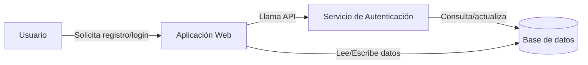
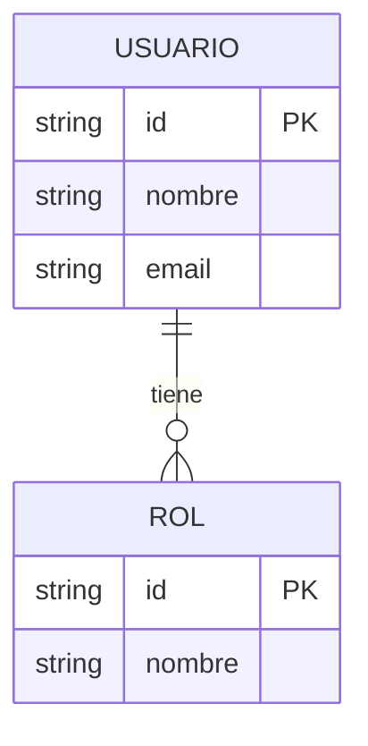
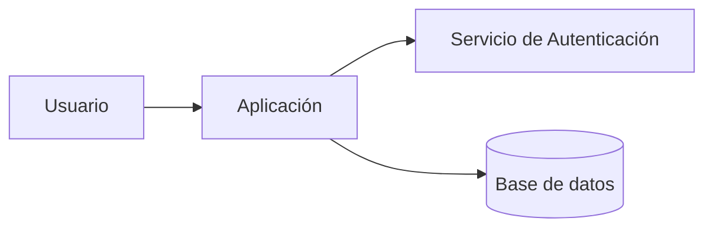

# Apuntes

## Índice

- [Semana 1](#semana-1)
- [Semana 2](#semana-2)
- [Semana 3](#semana-3)
- [Semana 4](#semana-4)
- [Semana 5](#semana-5)
- [Semana 6 (RUP)](#semana-6-rup)
- [Semana 10](#semana-10)
- [Semana 11](#semana-11)

## Semana 1

### Objetivos

- Entender el ciclo de vida del software y sus fases principales.
- Identificar entregables y responsabilidades en cada fase.

### ¿Qué es el ciclo de vida del software?

El ciclo de vida del software es la secuencia de fases ordenadas y repetibles que se siguen para planificar, construir, verificar, desplegar y mantener un sistema. Su objetivo es mitigar riesgos, mejorar la calidad y facilitar la gestión del proyecto.

### Fases típicas

1. **Requisitos:** identificar necesidades del cliente y del usuario. Entregables: documento de requisitos (funcionales y no funcionales), historias de usuario.
2. **Análisis / Especificación:** modelado de requisitos (casos de uso, DFD, modelos conceptuales). Entregables: especificación detallada y diagramas.
3. **Diseño:** arquitectura y diseño de módulos e interfaces. Entregables: diagramas de arquitectura, esquemas de base de datos.
4. **Implementación:** desarrollo del código y pruebas unitarias. Entregables: código fuente y pruebas.
5. **Pruebas:** verificación y validación (unitarias, integración, sistema, aceptación). Entregables: informes de pruebas y plan de corrección.
6. **Despliegue:** entrega a producción, configuración y puesta en marcha. Entregables: scripts de despliegue y manuales.
7. **Mantenimiento:** corrección de errores, mejoras y adaptación a cambios. Entregables: parches y nuevas versiones.

## Semana 2

### Diferencia entre requerimiento y requisito

- **Requerimiento:** necesidad o problema que debe resolverse (qué se necesita). Ejemplo: "El sistema debe permitir gestionar usuarios".
- **Requisito:** condición específica y verificable que cumple un requerimiento (cómo se cumple). Ejemplo: "El sistema permitirá crear usuarios con correo válido y contraseña de al menos 8 caracteres".

### Diferencia entre grupo y equipo

- **Grupo:** colección de personas con objetivos individuales.
- **Equipo:** grupo con objetivo común, roles definidos e interdependencia.

### Verificación vs Validación

| Aspecto  | Verificación                                | Validación                                 |
| -------- | ------------------------------------------- | ------------------------------------------ |
| Objetivo | ¿Se construye correctamente?                | ¿Se construye lo correcto para el usuario? |
| Tipo     | Estática (revisiones, análisis)             | Dinámica (pruebas con ejecución)           |
| Momento  | Fases tempranas y continuas                 | Fases finales y aceptación                 |
| Ejemplos | Revisiones de requisitos, análisis estático | Pruebas de aceptación, pruebas de usuario  |

## Semana 3

**Fecha:** 23/02/2024

### Tipos de metodologías

- **Tradicionales:** Cascada, V, Espiral. Enfocadas en fases secuenciales o iterativas con planificación extensa.
  - _Cascada:_ flujo secuencial; adecuado cuando los requisitos son estables.
  - _Modelo en V:_ destaca la trazabilidad entre fases y pruebas.
  - _Espiral:_ iterativo con énfasis en gestión de riesgos.

- **Ágiles:** Scrum, Kanban, XP. Enfoque iterativo y adaptativo, con entregas frecuentes.
  - _Scrum:_ roles (Product Owner, Scrum Master, Equipo), sprints de 2–4 semanas, ceremonias (Daily, Review, Retrospective).
  - _Kanban:_ flujo continuo y límites WIP para optimizar el trabajo en curso.
  - _XP:_ prácticas de ingeniería (TDD, pair programming, integración continua).

### Comparativa rápida

- **Riesgo al cambio:** Tradicionales = mayor coste de cambios tardíos; Ágiles = menor coste por iteraciones.
- **Documentación:** Tradicionales requieren más documentación formal; Ágiles priorizan la comunicación directa y la documentación mínima necesaria.

## Semana 4

### Preguntas iniciales

1. Si tuvieras que construir un rascacielos, ¿empezarías a poner ladrillos hoy o dedicarías meses solo a los planos?
2. En el desarrollo de software, ¿qué pesa más: la velocidad de entrega o la documentación detallada de cada proceso?
3. ¿Has escuchado el término "metodologías pesadas"? ¿Qué te viene a la mente?

### SSADM y MERISE

#### SSADM (Structured Systems Analysis and Design Method)

- **Origen:** Reino Unido.
- **Enfoque:** metodológico y estructurado para el análisis y diseño de sistemas.
- **Fases:** planificación, estudio de viabilidad, análisis, diseño lógico, diseño físico, implementación y pruebas.
- **Técnicas:** DFD (diagramas de flujo de datos), modelos ER, ELH (Entity Life Histories).

#### MERISE

- **Origen:** Francia (años 70–80).
- **Enfoque:** modelado por niveles de abstracción (conceptual, lógico, físico).
- **Niveles:**
  - _Conceptual:_ Modelo Conceptual de Datos (MCD), definición de entidades y relaciones.
  - _Lógico/Organizativo:_ Modelo Lógico de Datos (MLD), reglas y normalización.
  - _Físico:_ MPD, detalles de implementación en la base de datos.

#### Diferencias clave

- **Enfoque:** SSADM = más prescriptivo y estructurado; MERISE = separación clara entre niveles Conceptual / Lógico / Físico.
- **Modelado:** SSADM usa DFD y ELH; MERISE usa MCD/MLD/MPD.

#### Recomendación

- Añadir ejemplos prácticos (mini-DFD y MCD) y enlaces a herramientas de modelado (draw.io, diagrams.net).

### Ejemplos prácticos (mini-DFD y MCD)

A continuación hay un ejemplo simple de DFD de contexto y un mini-modelo conceptual de datos (MCD) en formato Mermaid para visualizar rápidamente la idea.

DFD (diagrama de contexto) — Mermaid flowchart:

Mini MCD (Mermaid ER):

Estos fragmentos pueden pegarse en la vista previa Markdown de GitHub o en herramientas como diagrams.net (DFD) para obtener una representación gráfica.

## Semana 5

### ¿Qué son las herramientas de procesos?

Son plataformas que facilitan la gestión, seguimiento y automatización de tareas y flujos de trabajo en una organización.

### Criterios para elegir una herramienta

- Tamaño del equipo y distribución geográfica.
- Necesidad de integración con CI/CD y repositorios.
- Coste y curva de adopción.

### Herramientas recomendadas

- **Jira:** gestión ágil a escala y seguimiento de sprints.
- **Trello:** tableros Kanban simples para equipos pequeños.
- **Asana:** gestión de proyectos con dependencias.
- **Microsoft Project:** planificación detallada con diagramas de Gantt.
- **GitHub/GitLab Issues + CI:** integración con repositorios y automatización.

### Buenas prácticas

- Definir workflows antes de configurar la herramienta.
- Automatizar integraciones y notificaciones.
- Documentar convenciones y capacitar al equipo.

## Semana 6 (RUP)

**Consulta:** hacer un mini proyecto de software en Jira

### ¿Qué es RUP?

RUP (Rational Unified Process) es un marco de proceso de desarrollo de software iterativo e incremental desarrollado por Rational Software (ahora parte de IBM). RUP se basa en principios de ingeniería de software y proporciona una guía estructurada para gestionar el ciclo de vida del software, desde la concepción hasta la entrega y mantenimiento.

RUP está basado en UML (Unified Modeling Language) y se organiza en cuatro fases principales: Incepción, Elaboración, Construcción y Transición. Cada fase tiene objetivos específicos, entregables y actividades recomendadas.

### Fases de RUP

Cada fase de RUP tiene objetivos específicos y entregables asociados:

1. **Incepción:** definir el alcance del proyecto, identificar riesgos y establecer una visión general. Entregables: caso de negocio, visión del producto, plan de proyecto inicial.
2. **Elaboración:** analizar y diseñar la arquitectura del sistema, mitigar riesgos críticos. Entregables: modelo de análisis, modelo de diseño, plan de proyecto detallado.
3. **Construcción:** desarrollar el sistema, realizar pruebas unitarias e integración. Entregables: código fuente, pruebas unitarias, documentación técnica.
4. **Transición:** preparar el sistema para su entrega, realizar pruebas de aceptación y despliegue. Entregables: versión final del producto, manuales de usuario, plan de soporte.

### Productos

1. **Modelos de análisis:** representan la estructura y comportamiento del sistema desde una perspectiva de análisis, utilizando diagramas UML como casos de uso, diagramas de clases y diagramas de secuencia.
2. **Modelo de implementación:** representa la estructura del sistema desde una perspectiva de implementación, utilizando diagramas de componentes y diagramas de despliegue.
3. **Modelo de despliegue:** representa la distribución física del sistema, incluyendo nodos y artefactos.

### Métricas

RUP utiliza métricas para evaluar el progreso y la calidad del proyecto, como el número de casos de uso implementados, la cobertura de pruebas y la cantidad de defectos encontrados.

## Semana 10

### Notas y recordatorios

Contenido relacionado con RUP consolidado en la sección "Semana 6 (RUP)". Aquí puedes añadir apuntes adicionales, ejemplos prácticos o ejercicios relacionados con métricas y análisis.

Ejemplo breve: Dimensiones del RUP — eje de tiempo (fases) y eje de contenido (artefactos y modelos).

## Semana 11

### Manifiesto Ágil

- Individuos e interacciones sobre procesos y herramientas.
- Software funcionando sobre documentación extensiva.
- Colaboración con el cliente sobre negociación de contratos.
- Responder al cambio sobre seguir un plan.

### Principios del Manifiesto Ágil

1. Nuestra mayor prioridad es **satisfacer al cliente** mediante la entrega temprana y continua de software valioso.
2. Aceptamos que los requisitos cambien, incluso en etapas tardías del desarrollo. Los procesos ágiles **aprovechan el cambio** para proporcionar ventaja competitiva al cliente.
3. **Entregamos software funcional con frecuencia**, desde un par de semanas hasta un par de meses, con preferencia a los períodos de tiempo más cortos.
4. Los responsables de negocio y los desarrolladores deben **trabajar juntos de forma cotidiana** durante todo el proyecto.
5. Construimos proyectos en torno a **individuos motivados**. Les damos el entorno y el apoyo que necesitan, y confiamos en ellos para hacer el trabajo.
6. El método más eficiente y efectivo de comunicar información al equipo de desarrollo y entre sus miembros es mediante la **conversación cara a cara**.
7. El **software funcionando** es la medida principal de progreso.
8. Los procesos ágiles promueven el desarrollo sostenible. Los patrocinadores, desarrolladores y usuarios deben ser capaces de mantener un **ritmo constante** de forma indefinida.
9. La **atención continua a la excelencia técnica** y al buen diseño mejora la agilidad.
10. **La simplicidad**, o el arte de maximizar la cantidad de trabajo no realizado, es esencial.
11. Las mejores arquitecturas, requisitos y diseños emergen de **equipos autoorganizados**.
12. A intervalos regulares, el equipo reflexiona sobre cómo **ser más efectivo**, para luego ajustar su comportamiento en consecuencia.

### Beneficios del enfoque ágil

- Mayor flexibilidad y adaptabilidad a cambios.
- Entrega temprana y continua de valor al cliente.
- Mejora de la comunicación y colaboración entre equipos y con el cliente.
- Mayor satisfacción del cliente y del equipo.
- Reducción de riesgos al identificar problemas temprano en el proceso.
- Fomento de la innovación y creatividad al permitir iteraciones rápidas y feedback constante.
- Mejora de la calidad del software al enfocarse en pruebas continuas y feedback temprano.
- Mayor motivación y compromiso del equipo al trabajar en un entorno colaborativo y autoorganizado.
- Mejora de la visibilidad del progreso del proyecto a través de entregas frecuentes y métricas ágiles.
- Fomento de la mejora continua al reflexionar regularmente sobre el proceso y ajustar prácticas según sea necesario.

### Conclusión

El Manifiesto Ágil y sus principios proporcionan un marco para el desarrollo de software que enfatiza la colaboración, la flexibilidad y la entrega continua de valor. Adoptar un enfoque ágil puede mejorar significativamente la calidad del software, la satisfacción del cliente y la eficiencia del equipo, permitiendo a las organizaciones adaptarse rápidamente a los cambios y mantenerse competitivas en un entorno dinámico.

### ¿Qué es el manifiesto ágil?

Publicado en 2001 por un grupo de desarrolladores de software que buscaban una alternativa a los enfoques tradicionales de desarrollo, que a menudo eran rígidos y no respondían bien a los cambios. El manifiesto se basa en cuatro valores fundamentales y doce principios que guían la forma en que los equipos de desarrollo deben trabajar para crear software de alta calidad de manera eficiente y efectiva.

### Aplicaciones prácticas del manifiesto ágil

- **Sprints y iteraciones:** en lugar de planificar todo el proyecto de una vez, los equipos ágiles trabajan en ciclos cortos llamados sprints, que suelen durar entre 1 y 4 semanas. Al final de cada sprint, se entrega un incremento funcional del software, lo que permite obtener feedback temprano y ajustar el rumbo según sea necesario.
- **Reuniones diarias:** los equipos ágiles suelen tener reuniones diarias (daily stand-ups) para discutir el progreso, identificar obstáculos y coordinar el trabajo. Esto fomenta la comunicación y la colaboración entre los miembros del equipo.
- **Feedback continuo:** el enfoque ágil enfatiza la importancia de obtener feedback temprano y frecuente de los clientes y usuarios finales. Esto permite a los equipos ajustar sus prioridades y asegurarse de que están construyendo algo que realmente satisface las necesidades del cliente.

## Ejercicio (plantilla)

### Título
Diseño de un sistema de gestión de usuarios: DFD, MCD y requisitos.

### Objetivo
Aplicar conceptos de análisis y diseño (DFD y MCD), identificar requisitos funcionales y no funcionales, y elaborar pruebas de aceptación básicas.

### Enunciado
Diseña un sistema que permita el registro y autenticación de usuarios, gestión de perfiles, asignación de roles y búsqueda básica de usuarios. Debes producir diagramas y documentación mínima que muestren la propuesta de solución.

### Entregables
- DFD de contexto (nivel 0) y DFD de nivel 1 (Mermaid o imagen).
- Modelo conceptual de datos (MCD) y, opcionalmente, modelo lógico (MLD).
- Lista de requisitos funcionales y no funcionales.
- Plan de pruebas de aceptación con al menos 5 casos.

### Pasos sugeridos
1. Identificar actores y casos de uso principales.
2. Dibujar el DFD de contexto y un DFD de nivel 1 con los procesos principales.
3. Diseñar el MCD con las entidades `USUARIO`, `ROL` y relaciones.
4. Enumerar requisitos funcionales (CRUD, autenticación, roles) y no funcionales (seguridad, rendimiento).
5. Definir 5 pruebas de aceptación (registro, login, asignación de rol, edición de perfil, búsqueda).

### Criterios de evaluación
- Completitud de los entregables.
- Claridad y legibilidad de diagramas.
- Trazabilidad entre requisitos, casos de uso y diagramas.
- Calidad de los casos de prueba (claros y reproducibles).

### Plantillas rápidas (Mermaid)

DFD contexto:

MCD base:

### Recursos
- diagrams.net / draw.io — https://app.diagrams.net/
- Mermaid Live Editor — https://mermaid.live/

---
